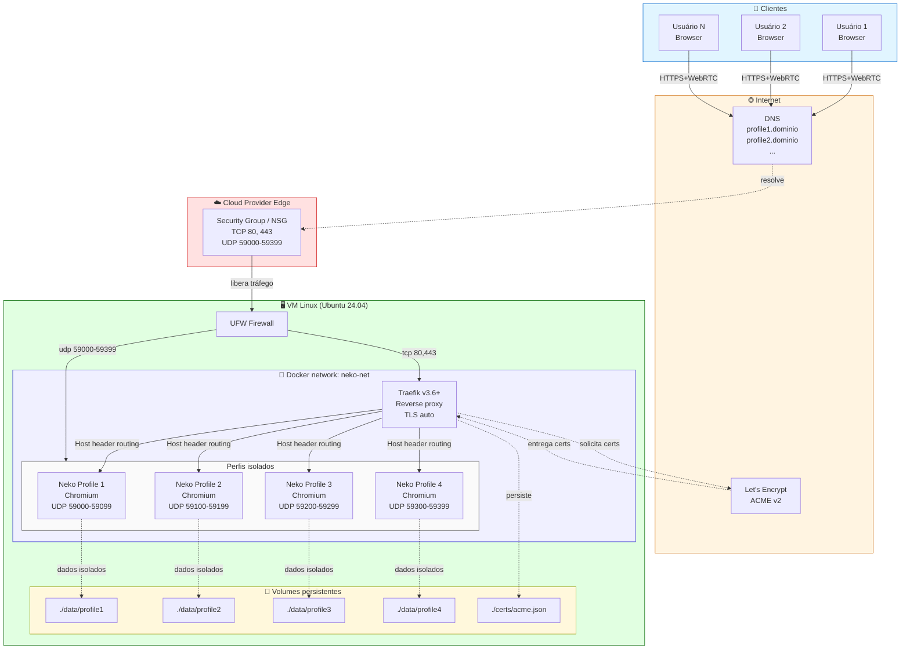
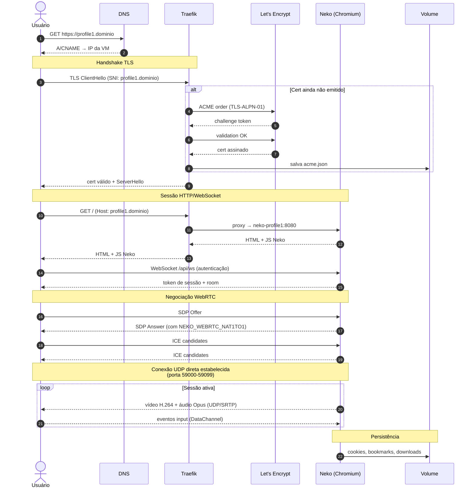
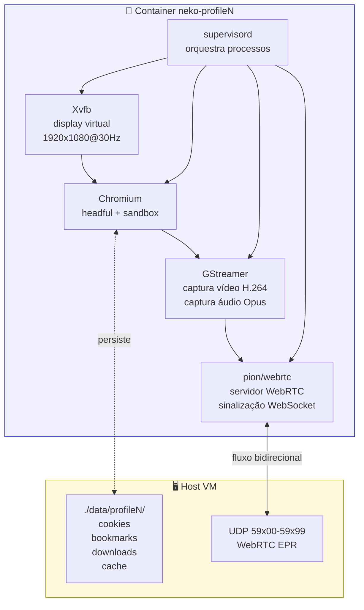

# Artemis AI

> Hub auto-hospedado de navegadores compartilhados para acesso a contas de IA — feito com Neko, Docker, Traefik e Let's Encrypt.

[](LICENSE)
[](https://www.docker.com/)
[](https://traefik.io/)
[](https://github.com/m1k1o/neko)
[](https://azure.microsoft.com/)

---

## ⚡ TL;DR

Times de tecnologia gastam centenas de dólares por mês em licenças individuais de ChatGPT, Claude, Perplexity e similares. **Artemis AI** é uma POC open-source que resolve isso de outra forma: em vez de compartilhar credenciais (que é frágil, inseguro e detectável), compartilha o **navegador autenticado**. Cada usuário acessa via streaming WebRTC, vê a mesma sessão, e a conta nunca sai do servidor.

É um caso prático de **Browser Isolation as a Service** — categoria que o Gartner chama de RBI (*Remote Browser Isolation*) — montado com 100% open-source em uma tarde.

---

## 🐱 Construído sobre o Neko

> **Artemis AI usa o [Neko](https://github.com/m1k1o/neko) como motor de browser streaming.**
> Todo o crédito do projeto que torna isso possível vai para o autor e mantenedores do Neko ([@m1k1o](https://github.com/m1k1o) e contribuidores).
>
> Artemis AI é uma camada de **orquestração, documentação, e referência arquitetural** em cima do Neko — combinando-o com Traefik, Let's Encrypt, scripts de bootstrap e docs para um caso de uso específico (compartilhamento de contas de IA).
>
> 🔗 **Repositório oficial do Neko:** https://github.com/m1k1o/neko
> 📖 **Documentação do Neko:** https://neko.m1k1o.net/

Se este projeto te ajudou, **considere dar uma estrela no Neko também** — é o coração da solução.

---

## 🎯 Para quem isso serve

- **Times pequenos** que querem reduzir custo de licenças de IA sem virar caos de credenciais
- **Empresas** que precisam isolar acesso a sistemas web sensíveis (jurídico, gov, bancário)
- **Estudantes e laboratórios** querendo experimentar Browser Isolation, WebRTC, Traefik
- **Integradores e arquitetos** procurando referência prática para evoluir para Rancher/K8s
- **Profissionais de segurança** explorando alternativas a soluções comerciais (Cloudflare Browser Isolation, Menlo, Talon, Island, Kasm)

---

## 🧩 Arquitetura

### Visão geral do sistema



### Fluxo de uma requisição (do clique ao vídeo)



### Camadas de isolamento e segurança

```mermaid
flowchart LR
    subgraph external["🌐 Externo"]
        ATK[Tráfego potencialmente<br/>malicioso]
    end

    subgraph layer1["🛡️ Cloud Security Group"]
        L1[NSG/Firewall<br/>SSH só seu IP<br/>TCP 80, 443<br/>UDP 59000-59399]
    end

    subgraph layer2["🛡️ Host Firewall"]
        L2[UFW<br/>Defesa em profundidade<br/>fail2ban anti-bruteforce]
    end

    subgraph layer3["🛡️ TLS"]
        L3[Traefik + Let's Encrypt<br/>Cert auto-renovado<br/>HTTPS forçado]
    end

    subgraph layer4["🛡️ Docker Network"]
        L4[Bridge isolada<br/>neko-net<br/>Containers só pelo Traefik]
    end

    subgraph layer5["🛡️ Container Isolation"]
        L5[Kernel namespaces<br/>cgroups v2<br/>Volume dedicado<br/>Limits CPU/RAM]
    end

    subgraph layer6["🛡️ Neko Auth"]
        L6[Multiuser<br/>Senha USER + ADMIN<br/>WebSocket auth]
    end

    ATK --> L1
    L1 -->|filtra| L2
    L2 -->|filtra| L3
    L3 -->|termina TLS| L4
    L4 -->|roteia| L5
    L5 -->|expõe Neko| L6
    L6 -->|sessão autorizada| OK[✅ Acesso]

    style external fill:#ffe1e1,stroke:#cc0000
    style layer1 fill:#fff0e1,stroke:#cc6600
    style layer2 fill:#fff4dc,stroke:#cc8800
    style layer3 fill:#fffbe1,stroke:#aaaa00
    style layer4 fill:#f0ffe1,stroke:#669900
    style layer5 fill:#e1ffe1,stroke:#006600
    style layer6 fill:#e1ffec,stroke:#009966
```



### Anatomia de um perfil Neko

Cada um dos 4 containers Neko é uma cópia idêntica com config independente:



**Cada perfil tem:**

- **Volume persistente** — cookies, bookmarks, histórico, downloads sobrevivem a restart
- **Faixa exclusiva de portas WebRTC** — vídeo streaming sem colisão entre perfis
- **Modo multiuser** — vários usuários veem a mesma sessão, com 2 níveis de senha (USER e ADMIN)
- **Limites de CPU e RAM** — `cpus: 1.5`, `memory: 3g` por container
- **Upload de arquivos** — drag & drop direto para campos `<input type="file">` ou para a sidebar de arquivos
- **Reset trivial** — destruir e recriar o container limpa qualquer estado indesejado em segundos

> 📐 Diagramas detalhados, decisões de design e trade-offs em [docs/architecture.md](docs/architecture.md).

---

## 🧱 Stack

| Camada | Tecnologia | Licença |
|---|---|---|
| Browser streaming | [Neko](https://github.com/m1k1o/neko) (Chromium) | Apache 2.0 |
| Reverse proxy | [Traefik v3.6+](https://traefik.io/) | MIT |
| TLS | [Let's Encrypt](https://letsencrypt.org/) (TLS-ALPN-01) | gratuito |
| Container runtime | [Docker](https://www.docker.com/) 29+ | Apache 2.0 |
| Orquestração POC | [Docker Compose](https://docs.docker.com/compose/) | Apache 2.0 |
| Cloud | Microsoft Azure (qualquer cloud serve) | — |
| OS | Ubuntu 24.04 LTS | GPL |
| Firewall | UFW + Cloud NSG | GPL |
| Hardening | fail2ban, unattended-upgrades, sysctl | GPL |
| DNS | Cloudflare (qualquer DNS serve) | — |

Detalhamento técnico de cada peça em [docs/technologies.md](docs/technologies.md).

---

## 🚀 Quick start

### Pré-requisitos

- Conta em qualquer cloud com VM Linux (Ubuntu 24.04 testado)
- Domínio próprio com acesso ao DNS
- Cliente local com Docker, Azure CLI (ou similar) e SSH

### Caminho rápido

```bash
git clone https://github.com/fpereirasilva/artemis-ai.git
cd artemis-ai

# 1. Criar VM (exemplo Azure)
./azure-create-vm.sh

# 2. Configurar 5 registros A/CNAME no DNS apontando para o IP/FQDN da VM
#    (veja docs/deployment.md para o template)

# 3. Copiar arquivos e bootstrapar
scp -r ./* user@<IP>:~/artemis-ai/
ssh user@<IP> 'cd artemis-ai && bash bootstrap-vm.sh'

# 4. Configurar variáveis (PUBLIC_IP, senhas)
cp .env.example .env
nano .env

# 5. Subir o stack
make up
```

Documento completo passo-a-passo: [docs/deployment.md](docs/deployment.md).

---

## 💡 Casos de uso reais

| Caso | Por que Artemis ajuda |
|---|---|
| Time pequeno usando 1 conta corporativa de IA | Cada um acessa o mesmo perfil sem brigar com sessão única |
| Acesso supervisionado a sistemas críticos | Modo multiuser permite admin assistir o user remoto |
| Onboarding sem instalar software no notebook | Funcionário acessa pelo navegador, sem VPN ou cliente nativo |
| Auditoria de acesso a portais sensíveis | Volume persistente registra cada sessão; gravação opcional via ffmpeg sidecar |
| Sandbox para testar links suspeitos | Container efêmero, isola da rede corporativa |
| Demos ao vivo de produto SaaS | Plateia inteira vê o mesmo navegador via link compartilhado |

Mais cenários em [docs/use-cases.md](docs/use-cases.md).

---

## 📊 Custo de referência

Estimativa em Azure Brazil South (preços variam, [confirme aqui](https://azure.microsoft.com/pricing/calculator/)):

| Estado | Custo mensal aproximado |
|---|---|
| VM ligada 24/7 (D4s_v5, 4 vCPU / 16 GB) | ~US$ 155/mês |
| VM desligada (`deallocate`, mantém disco) | ~US$ 14/mês |
| Tráfego de saída | varia conforme uso |

Coberto facilmente por créditos de assinatura Visual Studio ou tier gratuito de outras clouds.

---

## ⚠️ Limitações honestas (leia antes de adotar)

- **Latência de digitação** — RBI tem ~50–150 ms de delay. Aceitável para navegação, ruim para call centers.
- **Vídeo dentro do RBI** — videoconferência (Meet/Teams) dentro do navegador remoto é problemática. O escopo desta POC é navegação web, não VC.
- **Compliance** — antes de adotar para dados sensíveis, valide LGPD, retenção, criptografia em repouso. O projeto fornece a base; políticas são responsabilidade do operador.
- **DRM** — Chromium não tem Widevine. Netflix/Prime/Disney+ não funcionam (mas Chrome real funcionaria — basta trocar a imagem).
- **Antidetect** — Esta POC **não** é um antidetect browser tipo AdsPower/Multilogin. Se seu caso for multi-conta em sites com detecção, esta solução não resolve.
- **Termos de uso de IA** — verifique os Terms of Service dos provedores de IA antes de compartilhar contas com seu time. Cada provedor tem regras diferentes sobre uso compartilhado.

---

## 🛣️ Roadmap

- [x] POC com 4 perfis Docker Compose
- [x] TLS automático via Let's Encrypt
- [x] Upload de arquivos drag & drop
- [x] Documentação pública
- [ ] Provisioning sob demanda via API
- [ ] Painel admin web para criação de perfis
- [ ] Gravação automática de sessão (ffmpeg sidecar + S3)
- [ ] Migração para Kubernetes (Rancher/RKE2)
- [ ] Integração com Keycloak (SSO)
- [ ] Network policies (egress controlado por perfil)
- [ ] Escala automática
- [ ] Helm chart oficial

Discussão e priorização em [Issues](https://github.com/fpereirasilva/artemis-ai/issues).

---

## 🐛 Problemas conhecidos e soluções

Os 4 mais comuns que travam qualquer tutorial copiado:

1. **Cloudflare proxy ativo quebra TLS-ALPN-01 e WebRTC UDP** — desligue o proxy laranja nos subdomínios do Neko (deixe nuvem cinza / DNS only).
2. **Docker 29+ com Traefik antigo** — use `traefik:v3.6` ou superior; versões anteriores não negociam a API mínima 1.40.
3. **`NEKO_WEBRTC_NAT1TO1`** — sem isso, ICE candidate sai com IP interno e o vídeo nunca conecta atrás de NAT.
4. **Faixa de portas UDP fechada** — abra UDP 59000-59399 no NSG da cloud E no UFW da VM.

Detalhamento e diagnóstico em [docs/troubleshooting.md](docs/troubleshooting.md).

---

## 🤝 Contribuindo

Pull requests bem-vindos. Para mudanças grandes, abra uma Issue antes para discussão.

Veja [CONTRIBUTING.md](CONTRIBUTING.md) para padrões de commit, branch e revisão.

---

## 📄 Licença

[MIT](LICENSE) — use, fork, modifique, comercialize. Sem garantias.

---

## 🙏 Agradecimentos

- [m1k1o/neko](https://github.com/m1k1o/neko) — o coração desta solução
- [Traefik Labs](https://traefik.io/) — proxy excelente, configuração mínima
- [Let's Encrypt](https://letsencrypt.org/) — TLS gratuito mudou a internet
- Comunidades open-source que tornam tudo isso possível

---

**Artemis AI** — *Browser Isolation que cabe num docker-compose.*
