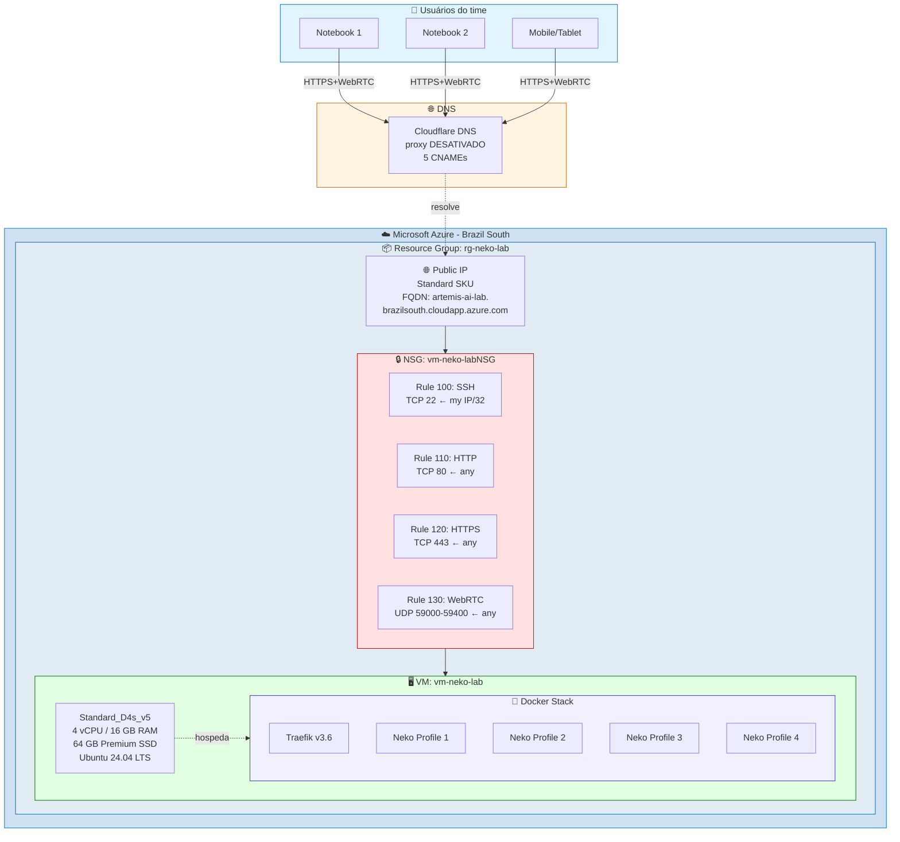
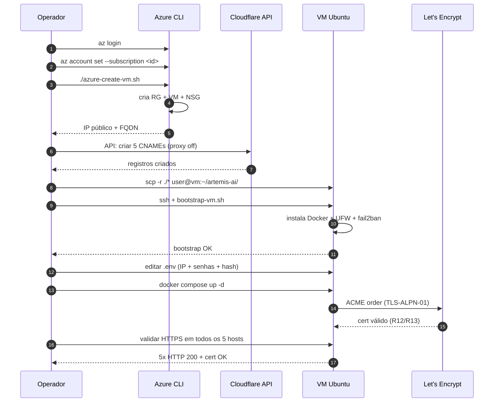

# Implementação no Azure — case study real

> Documento que descreve **a implementação real** que originou este projeto: decisões de cloud, números reais de tempo e custo, problemas que apareceram e como foram resolvidos. Use como referência para reproduzir em qualquer cloud.

---

## TL;DR — números da implementação

| Métrica | Valor |
|---|---|
| Tempo total (do `az login` ao primeiro acesso funcional) | **~3 horas** (incluindo troubleshooting) |
| Tempo de bootstrap automatizado puro (depois das correções) | **~15 minutos** |
| Custo da VM ligada 24/7 | ~US$ 155/mês |
| Custo da VM desligada (`az vm deallocate`) | ~US$ 14/mês |
| Comandos manuais executados | 0 (tudo via scripts) |
| Tamanho final da imagem stack | ~5 GB (Traefik + 4 Neko Chromium) |
| Resolução de cada perfil | 1920×1080 @ 30 fps |

---

## Stack final implementado



---

## Por que Azure?

A POC original foi feita no Azure por 4 motivos:

1. **Créditos disponíveis** — assinatura Visual Studio Enterprise dá ~US$ 150/mês de crédito; coberto integralmente
2. **Latência baixa pra usuários BR** — região Brazil South (RJ) entrega <30 ms para clientes em SP/RJ
3. **Reputação ASN** — IPs Azure raramente caem em blacklists de antifraud de grandes provedores
4. **Azure CLI** — automatizar tudo via `az` é direto, sem precisar de Terraform pra um caso simples

Funciona idêntico em **AWS, GCP, DigitalOcean, Hetzner ou qualquer cloud** que ofereça VM Linux. O projeto inclui apenas um script de exemplo Azure (`azure-create-vm.sh`); a estrutura é portável.

---

## Sizing escolhido — por quê D4s_v5

| Opção avaliada | vCPU/RAM | Custo/mês ligada | Decisão |
|---|---|---|---|
| Standard_B2s | 2/4 GB | ~US$ 30 | Subdimensionada para 4 perfis ativos |
| Standard_D2s_v5 | 2/8 GB | ~US$ 75 | Borderline — apertaria com 2 perfis em uso pesado |
| **Standard_D4s_v5** | **4/16 GB** | **~US$ 155** | ✅ **Escolhida** — folga para 4 perfis + Traefik |
| Standard_D8s_v5 | 8/32 GB | ~US$ 310 | Overkill para POC, considerar se >4 perfis ativos |

**Decisão técnica:** cada container Neko sob uso ativo consome ~1.5 vCPU. Com 4 perfis × 1.5 = 6 vCPU pico teórico. Mas raramente todos os 4 estão ativos simultaneamente. D4s_v5 com 4 vCPU dá folga real para 2-3 simultâneos sem contenção, e degrade graceful se passar disso.

**Disco:** 64 GB Premium SSD (~US$ 10/mês) cobre OS + imagens Docker (~5 GB) + perfis dos usuários (~5-10 GB cada com cache).

---

## Configuração de rede

### NSG (Network Security Group)

```
Priority  Name            Protocol  Port           Source        Action
100       allow-ssh       TCP       22             <meu-ip>/32   Allow
110       allow-http      TCP       80             *             Allow
120       allow-https     TCP       443            *             Allow
130       allow-webrtc    UDP       59000-59400    *             Allow
```

> **Importante:** o SSH está **restrito ao IP do operador**, não exposto publicamente. Se seu IP residencial for dinâmico, use o comando do `azure-create-vm.sh` para atualizar a regra:
> ```bash
> NEW_IP=$(curl -4 -s ifconfig.me)
> az network nsg rule update -g rg-neko-lab --nsg-name vm-neko-labNSG \
>   -n allow-ssh --source-address-prefixes "${NEW_IP}/32"
> ```

### IP público

- **SKU:** Standard (estático)
- **Custo:** ~US$ 4/mês mesmo com VM desligada (preserva o IP)
- **Por quê estático:** se mudar, todos os DNS quebram

### DNS (Cloudflare)

```
Tipo   Nome                                  Valor                                            Proxy
CNAME  profile1.<seu-dominio>                artemis-ai-lab.brazilsouth.cloudapp.azure.com    DESATIVADO ☁️
CNAME  profile2.<seu-dominio>                artemis-ai-lab.brazilsouth.cloudapp.azure.com    DESATIVADO ☁️
CNAME  profile3.<seu-dominio>                artemis-ai-lab.brazilsouth.cloudapp.azure.com    DESATIVADO ☁️
CNAME  profile4.<seu-dominio>                artemis-ai-lab.brazilsouth.cloudapp.azure.com    DESATIVADO ☁️
CNAME  traefik.<seu-dominio>                 artemis-ai-lab.brazilsouth.cloudapp.azure.com    DESATIVADO ☁️
```

Os 5 registros foram criados via API REST do Cloudflare (script reproduzível, levou ~2 segundos) com `proxied: false`. **Crítico:** se deixar o proxy laranja ativo, o TLS-ALPN-01 do Let's Encrypt não funciona e o WebRTC quebra (ver [troubleshooting.md](troubleshooting.md#cloudflare-proxy-quebra-tudo)).

---

## Sequência exata da implementação



**Tempo cronometrado das etapas:**

| Etapa | Tempo |
|---|---|
| `azure-create-vm.sh` (criação completa) | ~3 min |
| Criação dos CNAMEs no Cloudflare | ~10 s (API) |
| Propagação DNS até resolver | ~30 s |
| `scp` dos arquivos para a VM | ~5 s |
| `bootstrap-vm.sh` (Docker + UFW + tuning) | ~4 min |
| Edit `.env` (PUBLIC_IP, senhas, hash) | ~3 min |
| `docker compose pull` (5 imagens) | ~2 min |
| `docker compose up -d` (start) | ~30 s |
| Emissão dos 5 certs Let's Encrypt | ~2 min |
| **Total automatizado** | **~15 min** |

---

## Gotchas encontrados durante esta implementação real

### 1. `azure-create-vm.sh` falhou na regra SSH com IPv6

**O que aconteceu:** o `curl -s ifconfig.me` retornou um endereço IPv6 do provedor de internet, e `az network nsg rule create` rejeitou `<ipv6>/32` (32 só vale para IPv4; IPv6 usa /128).

**Fix:** trocar para `curl -4 -s ifconfig.me` para forçar IPv4. Já corrigido no `azure-create-vm.sh` deste repo.

### 2. Token Cloudflare com escopo errado

**O que aconteceu:** primeiro token criado tinha `Zone:Read` mas faltava `Zone:DNS:Edit`. Listagem de zonas funcionou; criação de DNS dava `Authentication error 10000`.

**Fix:** recriar o token usando o template **"Edit zone DNS"** do painel Cloudflare, que já vem com as 2 permissões corretas. Tempo de TTL setado para 24h e revogado após uso.

### 3. Traefik v3.1 + Docker 29 = incompatível

**O que aconteceu:** ao subir o stack, Traefik logava em loop:
```
client version 1.24 is too old. Minimum supported API version is 1.40
```

Docker 29 (lançado abr/2026) dropou suporte a API < 1.40. Traefik <v3.5 envia API 1.24 hardcoded.

**Fix:** atualizar para `traefik:v3.6`. A env var `DOCKER_API_VERSION=1.45` **não** corrige (o problema está no SDK Go embutido).

### 4. WebRTC EPR sem `NEKO_WEBRTC_NAT1TO1`

**O que aconteceu:** ao testar o vídeo, sessão WebSocket conectava mas o vídeo ficava preto.

**Causa:** Neko anuncia ICE candidates com o IP **interno** da VM (10.0.0.x do Azure VNet). O cliente tenta UDP nesse IP e desiste.

**Fix:** setar `NEKO_WEBRTC_NAT1TO1: "<IP_PUBLICO>"` em cada perfil. Já está no `docker-compose.yml` deste repo, lendo de `${PUBLIC_IP}` no `.env`.

### 5. Upload de arquivos desabilitado por padrão

**O que aconteceu:** ao tentar anexar PDF no ChatGPT dentro do Neko, drag-and-drop não funcionava.

**Causa:** `NEKO_FILETRANSFER_ENABLED` defaulta para `false` no Neko.

**Fix:** adicionar `NEKO_FILETRANSFER_ENABLED: "true"` em cada perfil + criar `Downloads/` com `chown 1000:1000`. Já incluído.

---

## Custos reais detalhados (Azure Brazil South)

Baseado em [Azure Pricing Calculator](https://azure.microsoft.com/pricing/calculator/) (preços podem variar):

```
┌────────────────────────────────────────────────────────────┐
│ Item                              Ligada/mês  Desligada/mês│
├────────────────────────────────────────────────────────────┤
│ VM Standard_D4s_v5                  US$ 140    US$ 0       │
│ Disco OS 64 GB Premium SSD          US$  10    US$ 10      │
│ IP público estático Standard        US$   4    US$ 4       │
│ Tráfego de saída (~50 GB)           US$   4    US$ 0       │
├────────────────────────────────────────────────────────────┤
│ TOTAL                               US$ 158    US$ 14      │
└────────────────────────────────────────────────────────────┘
```

**Estratégia de economia adotada:**

```bash
# Final do dia: desligar
az vm deallocate -g rg-neko-lab -n vm-neko-lab

# Início do dia: ligar
az vm start -g rg-neko-lab -n vm-neko-lab
```

Com 8h diárias × 22 dias úteis = ~176h/mês ligada → custo proporcional ~US$ 38/mês.

Possível ainda automatizar via Azure Automation Runbook ou Logic App pra ligar/desligar em horários fixos. Não foi feito nesta POC porque desligar manual é trivial.

---

## Hardening aplicado pelo `bootstrap-vm.sh`

| Camada | Ação |
|---|---|
| **OS** | `apt upgrade` completo + `unattended-upgrades` ativo (patches automáticos) |
| **Docker** | Repositório oficial (não Snap, não distro) — versão sempre recente |
| **Firewall host (UFW)** | Default deny inbound, allow apenas 22/80/443/UDP 59000-59400 |
| **fail2ban** | Habilitado (banimento automático em brute-force SSH) |
| **Kernel** | Buffers UDP aumentados (`net.core.rmem_max=16777216`) para WebRTC |
| **Volumes** | `acme.json` com `chmod 600`; perfis com `chown 1000:1000` |
| **Segredos** | `.env` no `.gitignore`; nunca em logs; senhas geradas com `secrets` (Python) |

**Postura geral:** defesa em profundidade. Mesmo se o NSG do Azure for mal configurado, o UFW da VM bloqueia. Mesmo se um perfil for comprometido, os outros 3 estão isolados por kernel namespaces.

---

## Reproduzir esta exata implementação

Se você quer fazer uma cópia idêntica:

```bash
# 1. Clone o repo
git clone https://github.com/fpereirasilva/artemis-ai.git
cd artemis-ai

# 2. Login Azure
az login
az account set --subscription <SUA_SUBSCRIPTION_ID>

# 3. Crie a VM (Brazil South, D4s_v5)
chmod +x azure-create-vm.sh
./azure-create-vm.sh
# anote o IP público que aparece no fim

# 4. Configure seu DNS apontando 5 hosts para o IP/FQDN da VM
#    (use ./azure-create-vm.sh ou crie manualmente no painel do seu provedor)

# 5. Configure as variáveis
cp .env.example .env
# Edite com PUBLIC_IP e senhas geradas com secrets

# 6. Copie pra VM e bootstrap
scp -r ./* azureuser@<IP>:~/artemis-ai/
ssh azureuser@<IP>
cd ~/artemis-ai && bash bootstrap-vm.sh
exit && ssh azureuser@<IP>  # relogar para entrar no grupo docker

# 7. Suba o stack
cd ~/artemis-ai && make up

# 8. Acompanhe a emissão dos certs
make logs-traefik
```

Tempo total esperado: **15-20 minutos** (sem os gotchas que já estão corrigidos no repo).

---

## Próximas evoluções desta implementação

Itens que **não** foram implementados na POC inicial mas estão no [roadmap](../README.md#-roadmap):

- [ ] **Backup automático** dos volumes para Azure Blob Storage (rclone + cron)
- [ ] **Azure Monitor** com alertas de CPU/RAM/disco/cert expiring
- [ ] **Provisioning de perfil sob demanda** via API + Azure Container Instances
- [ ] **Migração para AKS** (Azure Kubernetes Service) quando passar de 10 perfis
- [ ] **Azure AD / Entra ID SSO** via Keycloak intermediário
- [ ] **Custom domain TLS** com Azure Front Door para multi-região

Cada um desses pode virar uma issue/PR neste repo conforme necessidade aparecer.

---

> 📐 Para detalhes arquiteturais genéricos (não específicos do Azure), veja [architecture.md](architecture.md).
> 🚀 Para reproduzir em outras clouds (AWS, GCP, etc.), veja [deployment.md](deployment.md).
> 🐛 Para troubleshooting durante a implementação, veja [troubleshooting.md](troubleshooting.md).
